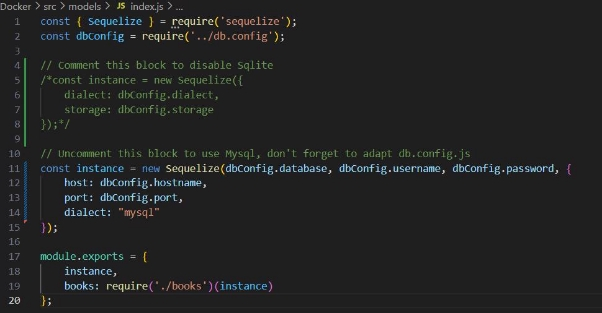
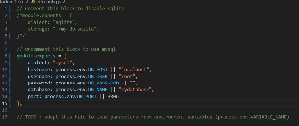
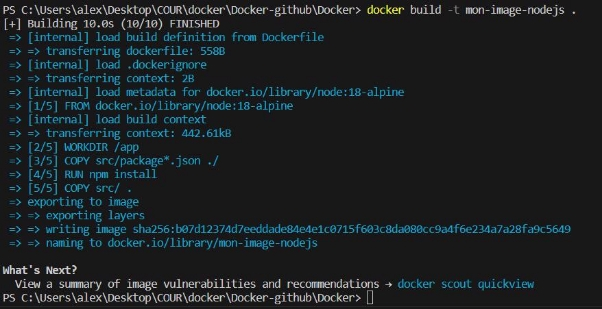
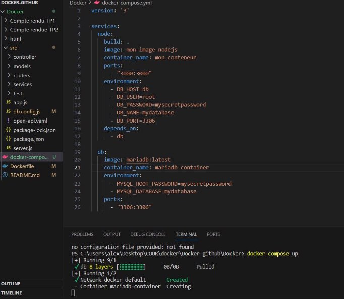
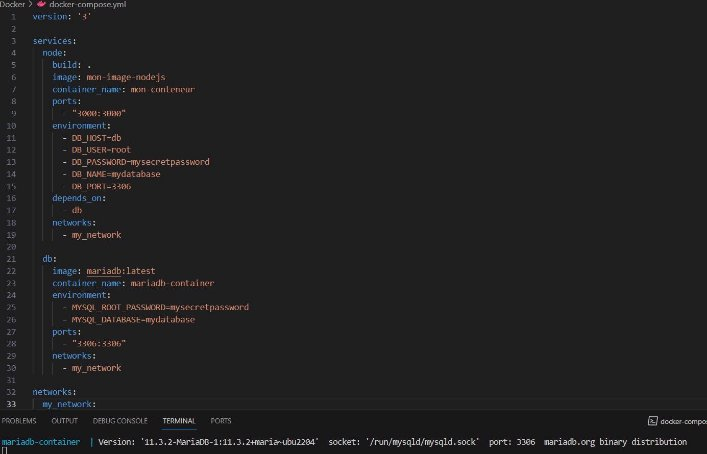
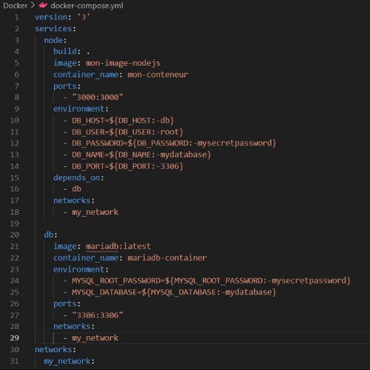

**TP2 Docker - MAZOYER Alexandre**

Fichier models/inex.js adapté :

Fichier db.config.js adapté :

Reconstruction de l'image Docker :

Lancement du conteneur avec la nouvelle image :

la commande ***docker-compose up*** construira les images, démarrera les deux services et configurera les conteneurs selon les spécifications du fichier **docker-compose.yml.**

Pour que l’application Node.js puisse utiliser la base de données conteneurisée dans Docker Compose, nous devons nous assurer que les services peuvent se connecter les uns aux autres.

Voici le fichier **docker-compose.yml** configurer pour utiliser des variables d'environnement :

Publié le port 3000 et exposer le port 3006 sans le publier :

**Q1 : Que se passe t'il si un de mes ports publiés est déjà utilisé ?**

Docker affichera un message d'erreur et ne pourra pas démarrer le conteneur.

Dans ce cas, on doit choisir un autre port disponible ou libérer le port déjà utilisé sur votre machine avant de relancer Docker Compose.

**Q2 : quelle option de la commande npm install permet de n'installer que les dépendances de production ?**

**npm install --production**

Cela installera uniquement les dépendances listées dans la section "dependencies" de votre fichier package.json.

**Q2bis : pourquoi faire cela ?**

l'utilisation de l'option **--production** est une bonne pratique pour garantir que votre environnement de production n'inclut que ce qui est strictement nécessaire pour exécuter votre application, tout en évitant les éléments superflus liés au développement.

**Q3 : Comment peut-on analyser la sécurité d'une application comme celle-ci (dépendances & image docker)**

Il y a des Outils de sécurité des dépendances : **npm audit**

De plus, il existe des outils de scanning d'images Docker tels que **Clair** ou **Trivy** pour analyser les images Docker à la recherche de vulnérabilités connues.

**Q4 : Pourquoi à l'étape 6 mon container node n'arrive pas à communiquer avec ma base de données si je laisse "localhost" en hostname ?**

Quand vous utilisez "localhost" comme nom d'hôte dans votre application Node.js pour se connecter à la base de données, cela signifie que votre application tente de se connecter à la base de données sur la même machine (le même conteneur Docker, dans ce cas). Cependant, dans un environnement Docker, chaque conteneur a son propre espace réseau isolé.
